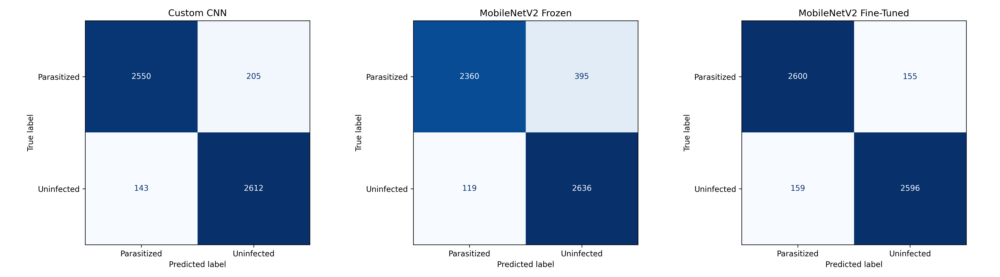
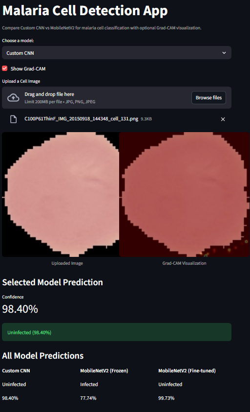
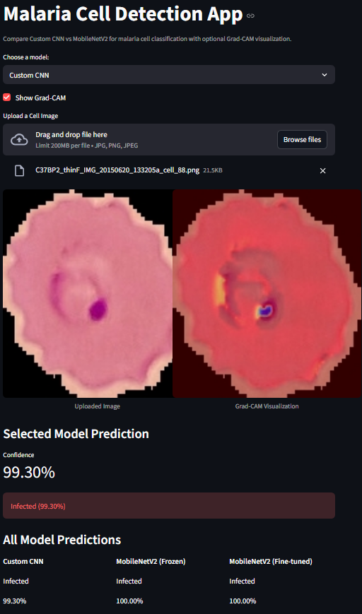

# InnovateMU Hackathon
# Malaria Image Classification using CNN

A **Convolutional Neural Network (CNN)** based machine learning model to detect **malaria-infected blood cells** from microscopic images.
Developed for the **InnovateMU Hackathon 2025**, this project demonstrates how deep learning can assist in automated medical image diagnosis.

---

## Project Overview

Malaria is a life-threatening disease affecting millions worldwide. Traditional diagnosis relies on manual microscopy, which is time-consuming and prone to human error. This project automates malaria detection using **image classification**, enabling fast and consistent predictions.

**Key features:**

- Binary classification: **Parasitized** vs **Uninfected**.
- CNN trained on the **Kaggle Malaria Dataset**
- Validation accuracy ~**94%**
- **Interactive Streamlit Web App** for real-time inference
- End-to-end pipeline: data cleaning -> training -> evaluation -> deployment

---

## Project Structure

malaria-image-classification/

│

├── notebooks/

│ └── 01_baseline_and_frozen_models.ipynb -> Custom CNN + MobileNetV2 frozen training

│ └── 02_finetune_mobilenetv2.ipynb -> Fine-tuning MobileNetV2

│ └── 03_model_evaluation.ipynb -> Model comparison and metrics visualization

│

├── results/

│ └── all_confusion_matrices.png

│ 

├── data/

│ └── raw/ # Raw Kaggle dataset (not tracked in git)

│ └── clean_cell_images/ # Cleaned dataset used for training

│

├── .gitignore

├── app.py # Streamlit inference app

├── requirements.txt

└── README.md

## Getting Started

### Prerequisites

- Python 3.8+
- Kaggle account (for downloading the dataset)

Install dependencies:

```bash
pip install -r requirements.txt
```

## Dataset

Source:
[Cell Images for Detecting Malaria - Kaggle](https://www.kaggle.com/datasets/iarunava/cell-images-for-detecting-malaria)

- ~27,000 labeled images
- Two classes: **Parasitized**, **Uninfected**
- Images resized to **128x128** for training
- Data cleaned to remove duplicated nested folders

---

## Model Details

### Custom CNN (Baseline)

- **Architecture**: Custom CNN
  - Conv2D -> MaxPooling -> Dropout -> Dense
- **Loss**: Binary Cross-Entropy
- **Optimizer**: Adam
- **Batch size**: 32
- **Epochs**: 10-20

---

### MobileNetV2 (Frozen Feature Extractor)

- **Base Model**: MobileNetV2 pretrained on ImageNet
- **Transfer Learning Strategy**: Feature extraction (base layers frozen)
- **Custom Head**: GlobalAveragePooling -> Dense -> Dropout -> Dense (sigmoid)
- **Loss**: Binary Cross-Entropy
- **Optimizer**: Adam
- **Batch Size**: 32
- **Epochs**: 10-15

---

### MobileNetV2 (Fine-Tuned)

- **Base Model**: MobileNetV2 pretrained on ImageNet
- **Transfer Learning Strategy**: Fine-tuning with top layers unfrozen
- **Unfrozen layers**: Top convolutional blocks for domain adaptation
- **Custom Head**: GlobalAveragePooling -> Dense -> Dropout -> Dense (sigmoid)
- **Loss**: Binary Cross-Entropy
- **Optimizer**: Adam (lower learning rate for stability)
- **Batch size**: 32
- **Epochs**: 10-15

---

## Pretrained Models
Due to GitHub file size limits, trained model weights are not stored directly in the repository.
They are available in the **GitHub Releases** section of this repository:
- Custom CNN trained from scratch
- MobileNetV2 with frozen base layers (feature extraction)
- MobileNetV2 fine-tuned with unfrozen layers

Download models from:
[MaryvilleUniversity-AI Releases](https://github.com/MaryvilleUniversity-AI/malaria-image-classification/releases)

After downloading, place the models in a `models/` directory before running inference.

---

## Model Comparison

| Model                    | Strategy                              | Accuracy | Precision | Recall | F1    |
|--------------------------|--------------------------------------|----------|-----------|--------|-------|
| Custom CNN               | Trained from scratch                  | ~94%     | ~0.93     | ~0.95  | ~0.94 |
| MobileNetV2 (Frozen)     | Transfer Learning (Frozen Layers)     | ~91%     | ~0.90     | ~0.91  | ~0.90 |
| MobileNetV2 (Fine-Tuned) | Transfer Learning + Unfrozen Layers   | 94.01%   | 0.932     | 0.950  | 0.941 |

## Confusion Matrices


### Key Observations
- The **custom CNN and fine-tuned MobileNetV2 achieved similar validation accuracy (~94%)**, indicating both models performed strongly on this dataset.
- The frozen MobileNetV2 model performed slightly worse, showing that pretrained ImageNet features alone were not fully optimal for microscopic cell images.
- Fine-tuning MobileNetV2 significantly improved performance, demonstrating the importance of adapting pretrained models to domain-specific data.

### Conclusion
Both the custom CNN and fine-tuned MobileNetV2 achieved high classification performance, with fine-tuning allowing the pretrained model to match the custom architecture. This suggests that while domain-specific feature learning is effective, pretrained models can achieve comparable results when properly adapted to the target domain.

---

### Performance

- Validation Accuracy: ~**94%**
- Evaluation includes:
  - Confusion Matrix
  - Precision, Recall, F1-score (classification report)

---

## Training the Model (Optional)

If you want to retrain the model from scratch:

1. Set up Kaggle API:
   - Upload `kaggle.json` to your working directory
   - Set permissions:
   ```bash
   chmod 600 kaggle.json
   ```
2. Run the notebook:

```bash
jupyter notebook notebooks/MalariaImageClassification.ipynb
```

The notebook:

- Downloads the dataset from Kaggle
- Cleans the folder structure
- Trains the CNN
- Saves the model to `models/malaria_model.keras`

> Note: Training was performed on Google Colab using an NVIDIA A100 GPU for faster experimentation.

---

## Run the Streamlit App

Use the pretrained model for inference:

```bash
streamlit run app.py
```

Steps:

1. Choose a model to use
2. Upload a blood cell image
3. The model predicts:
   - **Parasitized** or **Uninfected**
4. Displays prediction probability and the model's confidence

---

## Example Outputs




---

## Limitations

- Trained on a single dataset (may not generalize to all microscopes)
- Binary classification only (no parasite species classification)
- No clinical validation (research/demo purpose only)

---

## Future Work

- Add **transfer learning (ResNet, MobileNet, VGG16)**
- Add **Grad-CAM visualizations** for model interpretability
- Train on **multiple datasets for better generalization**
- Deploy as a **cloud-hosted web app**

---

## Acknowledgements

- Original project developed for the **InnovateMU 2025 Hackathon** by Daniel Lai, Ewan Poirier, Srivathsav Arumugam, and Ruth Ayele.
- This repository is a **fork maintained by the MaryvilleUniversity-AI GitHub organization**, furthering the project for research and educational purposes by an apprentice contributor.
- Tools: TensorFlow, Keras, Streamlit, Google Colab
- Dataset: Kaggle - Cell Images for Detecting Malaria

---

## Disclaimer

This project is for **research and educational purposes only** and is not intended for clinical use or medical diagnosis.
